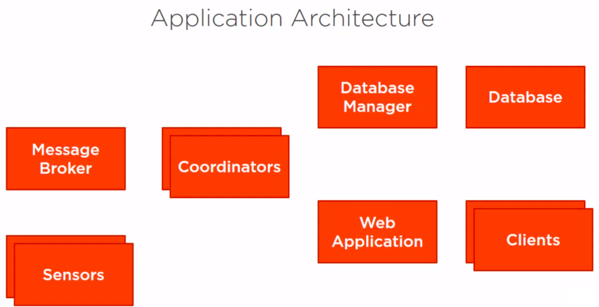
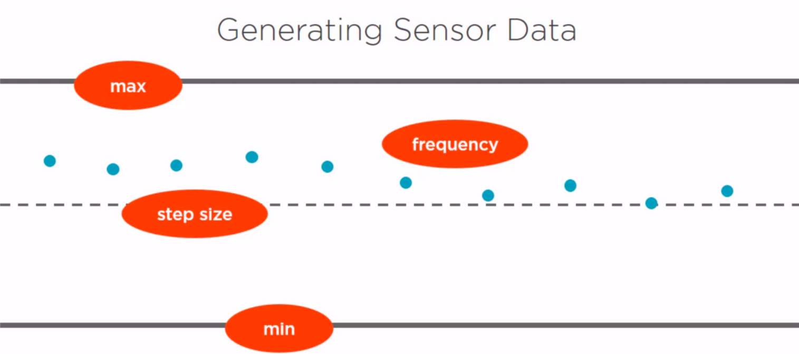
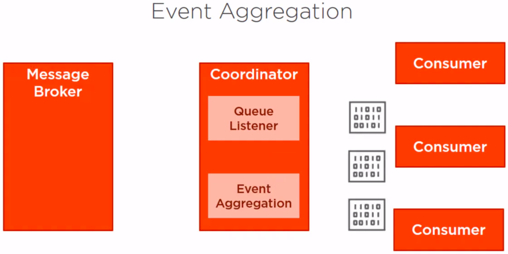
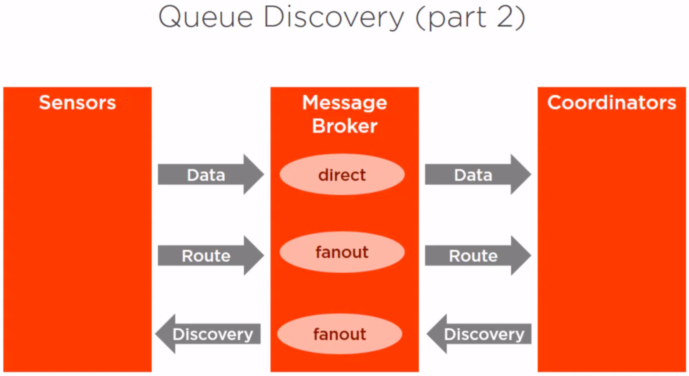

# Power plant monitoring system

### Main architecture

  

### Generating data for the sensors

  

### Aggregating data for the listeners

  

### Queue discovery
This is necessary because if the coordinator is down and at this moment a new sensor is turned on,
then the messages sending for this sensor will never be received due to the no reception of the 
message published in the fan-out exchange.
Since the coordinator wasn't running at that point, it has no idea to look for messages on the sensor's data queue.
That's the problem we fix with the queue discovery.  

  

